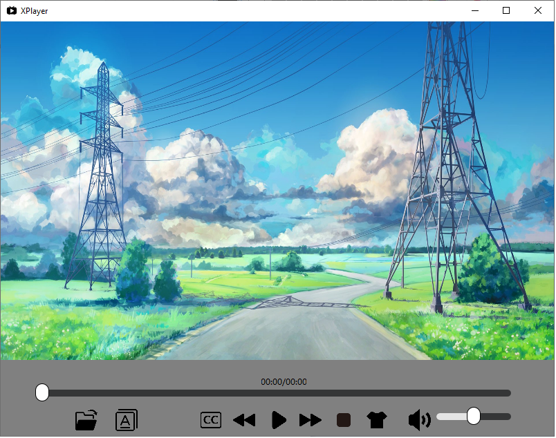

# XPlayer

[](https://www.python.org/)
[](https://www.python.org/)
[](https://pytorch.org/)

[TOC]

## 1. introduction

This is a simple video player based on the opensource framework ffmpeg.

Currently, it supports the below features:

- play video
- seek videos
- stop video
- open subtitle file
- alter the volume
- go on the video
- go back the video
- change the UI background

Just play whatever you want.

## 2. Build and Run

This project is constructed with Qt 5.12.9. So it is recommended to install it with the same version.

Open the XPlayer.pro in Qt creator and then simple run it with the debug mode.


If everything goes well, it will show you the main UI.



## 3. Framework

We use three thread to co-work to play the video. They are XDemuxThread, XVideoThread and XAudioThread.

The Demux thread is used to split the video element and audio element from the original video file. It uses ```av_read_frame``` to read AVpacket and then put it into video/audio packet queue according the stream index.

```
                    |------->AVPacket(video)

av_read_frame -------|

​                    |-------->AVPacket(audio)
```

In XVideoThread, it will get the AVPacket from the video queue.  It uses the ```avcodec_send_packet```/```avcodec_receive_packet```to decode the video AVPacket to AVframe. And then process it to QImage to show.

In XAudioThread, it will get the AVPacket from the audio queue. It uses the ```avcodec_send_packet```/```avcodec_receive_packet```to decode the audio AVPacket to AVframe. And then process it to QIODevice to play.


## 4.LICENSE

MIT license
